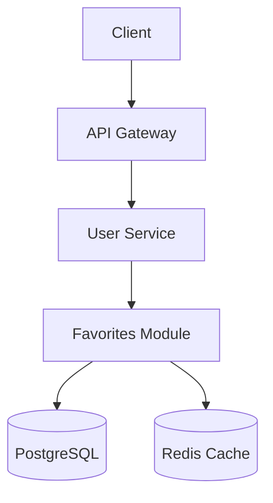

# Phase 1A: Discovery & Core Design

## Purpose
Establish the foundation of the technical design through discovery, architecture decisions, and core data model.

## Output
A lightweight design document (~300 lines) that answers:
- What problem are we solving and for whom?
- What's the high-level architecture approach?
- What are the core entities and their relationships?

## Core Principles

### Never Assume - Always Ask
```
If you don't know a technical detail, ASK.
Examples:
- "What version of [framework] are you using?"
- "Do you have an existing pattern for [feature]?"
- "What's your current database schema for [entity]?"
- "What's the expected scale? (requests/sec, data volume)"
```

### Top 1% Quality Standards
Designs must address:
- **Performance**: Query optimization, caching, async operations
- **Scalability**: Can handle 10x growth without architecture changes
- **Security**: Auth, authorization, input validation, data protection
- **Maintainability**: Clear patterns, minimal complexity, good abstractions

### Follow Existing Patterns
```
ALWAYS read existing code before proposing new patterns.
If the codebase uses Repository pattern, use Repository pattern.
If the codebase uses functional style, use functional style.
Consistency > personal preference.
```

## Phase 1A Process

### Step 1: Discovery Questions

#### Business Context
- What problem does this solve for users?
- What's the expected user impact? (how many users, how often)
- What are the success metrics?
- What's explicitly OUT of scope?
- Any timeline constraints or dependencies?

#### Technical Context
- What's the tech stack? (ask for specific versions)
- What's the current architecture pattern?
- Are there similar features we can reference?
- What's the current data model?
- What are the existing API patterns?
- What's the deployment model? (monolith, microservices, serverless)
- What's the current scale? (users, requests, data volume)
- What testing frameworks and patterns are used?

#### Scale & Load Questions
- What's the current request volume? (req/sec)
- What's the expected growth rate? (monthly/yearly)
- Peak vs average load ratio?
- Read/write ratio for this feature?
- Data growth rate? (records/day, GB/month)
- Geographic distribution of users?

#### Integration Context
- What other services/systems are involved?
- What events need to be published/consumed?
- What external APIs are needed?
- What shared data stores exist?
- What are the SLAs for dependent services?

#### Compliance Context
- Is there PII involved? What type?
- What data retention requirements exist?
- Are there audit logging requirements?
- GDPR/CCPA or other regulatory requirements?

### Step 2: Architecture Design

#### CRITICAL: Visual Overview Required
**ALWAYS create a visual diagram FIRST before detailed design.**

Choose the most appropriate visual for the design:
- **Architecture Diagram**: For system components and their relationships
- **Sequence Diagram**: For request/response flows and interactions
- **Data Flow Diagram**: For data movement through the system
- **State Diagram**: For state machines or workflow processes

Use ASCII for simplicity or Mermaid for richer diagrams:

**ASCII Example:**
```
┌─────────────┐
│   Client    │
└──────┬──────┘
       │ HTTPS
       ▼
┌─────────────────────────────────┐
│      API Gateway / LB           │
└────────────┬────────────────────┘
             │
             ▼
┌─────────────────────────────────┐
│       User Service              │
│  ┌──────────────────────────┐   │
│  │  Favorites Module        │   │
│  │  - Controller            │   │
│  │  - Service               │   │
│  │  - Repository            │   │
│  └──────────┬───────────────┘   │
└─────────────┼───────────────────┘
              │
              ▼
       ┌─────────────┐
       │  PostgreSQL │
       │  - users    │
       │  - favorites│
       └─────────────┘
```

**Mermaid Example:**


#### Approach Selection
Present 2-3 approaches with:
- **Description**: How it works
- **Pros**: Benefits and strengths
- **Cons**: Drawbacks and limitations
- **Recommendation**: Which to choose and why

Example:
```markdown
### Approach A: Dedicated Favorites Service
**Pros:**
- Clean separation of concerns
- Independent scaling
- Can be owned by different team

**Cons:**
- Operational overhead (deployment, monitoring)
- Network latency for favorites checks
- More complex local development

**Recommendation:** Only if favorites will have complex logic (recommendations, ML, etc.)

### Approach B: Favorites Module in User Service
**Pros:**
- Simple deployment
- No network calls for user+favorites queries
- Easier local development

**Cons:**
- User service grows in scope
- Coupled scaling (can't scale favorites independently)

**Recommendation:** ✅ Choose this for MVP - simple, fast, meets requirements
```

#### Architecture Decision Record (ADR)
For significant decisions, create an ADR:

```markdown
### ADR-001: [Decision Title]

**Status:** Proposed | Accepted | Deprecated | Superseded
**Date:** [YYYY-MM-DD]
**Deciders:** [List of people involved]

**Context:**
[Why this decision is needed. What forces are at play.]

**Decision:**
[What we decided to do.]

**Consequences:**
- **Positive:** [Benefits gained]
- **Negative:** [Trade-offs accepted]
- **Risks:** [Potential issues to monitor]

**Alternatives Considered:**
| Option | Pros | Cons | Why Not Chosen |
|--------|------|------|----------------|
| [Alt 1] | ... | ... | ... |
| [Alt 2] | ... | ... | ... |
```

### Step 3: Data Model Design (Core Entities Only)

#### Entity Definition
For each entity, specify:
```markdown
[EntityName]
├── id: uuid (PK) - Unique identifier
├── [field]: [type] - [description, constraints]
├── created_at: timestamp - Record creation time
└── updated_at: timestamp - Last modification time

Relationships:
- [entity] has many [related_entity] (1:N)
- [entity] belongs to [related_entity] (N:1)
- [entity] has many [related_entity] through [join_table] (M:N)

Indexes:
- PRIMARY KEY (id)
- INDEX idx_[table]_[column] ON [table]([column]) - [reason for index]
- UNIQUE INDEX idx_[table]_[columns] ON [table]([col1], [col2]) - [reason]

Constraints:
- FOREIGN KEY (user_id) REFERENCES users(id) ON DELETE CASCADE
- CHECK ([column] > 0)
```

**Note:** Keep it simple for Phase 1A. Detailed lifecycle, compliance, and migration strategy will be covered in Phase 1C.

## Output Document Structure

```markdown
# Design: [Feature Name] - Phase 1A

## Executive Summary
[2-3 sentences for stakeholder presentation]

## Use Case & Business Value
[What we're building and why - from discovery questions]

## Architecture Decision

### Chosen Approach
[Detailed description with diagram]

### Alternatives Considered
[Table with options, pros, cons, why not chosen]

### Architecture Diagram
[ASCII or Mermaid diagram]

## Core Data Model

### Entities

#### [Entity 1]
[Definition with fields, relationships, indexes, constraints]

#### [Entity 2]
[Definition with fields, relationships, indexes, constraints]

## Next Steps
- Phase 1B: Define API contracts, integration points, and testing strategy
- Phase 1C: Address security, performance, and operational concerns
```

## Quality Checklist for Phase 1A

Before moving to Phase 1B, verify:

### Completeness
- [ ] All discovery questions answered (or marked as assumptions)
- [ ] Visual diagram included
- [ ] Architecture decision is clear with alternatives documented
- [ ] Core entities defined with relationships

### Quality
- [ ] Architecture decision is justified
- [ ] Alternatives are documented
- [ ] Diagram is clear and accurate
- [ ] No ambiguous requirements
- [ ] No assumptions without clarification

### Clarity
- [ ] Can a developer understand the high-level approach?
- [ ] Are the core entities and their purpose clear?
- [ ] Is it obvious why this approach was chosen?

## Anti-Patterns to Avoid

❌ **Assuming without asking**
```
"We'll use Redis for caching" 
→ Ask: "Do you already have Redis? What's your caching strategy?"
```

❌ **Over-engineering**
```
"We'll build a microservice with event sourcing and CQRS"
→ Start simple, add complexity only when needed
```

❌ **Ignoring existing patterns**
```
"Let's use a new ORM for this feature"
→ Use the ORM the codebase already uses
```

❌ **Vague requirements**
```
"The API should be fast"
→ Define: "p95 latency < 200ms under 1000 req/s load"
```

## Timeline Guidance

| Complexity | Discovery | Design | Review | Total |
|------------|-----------|--------|--------|-------|
| Simple feature | 15-30 min | 30-45 min | 15 min | 1-1.5 hours |
| Medium complexity | 30-45 min | 45-60 min | 30 min | 2-2.5 hours |
| Complex system | 1-2 hours | 2-3 hours | 1 hour | 4-6 hours |

## Definition of Done

Phase 1A is complete when:
- [ ] All discovery questions answered
- [ ] Visual diagram created and reviewed
- [ ] Architecture decision made and documented
- [ ] Core data model defined
- [ ] User approves direction: "Yes, this approach makes sense"
- [ ] Document saved to `.monkeymode/{feature-name}/design/1a-discovery.md`
